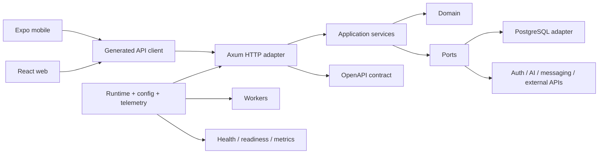
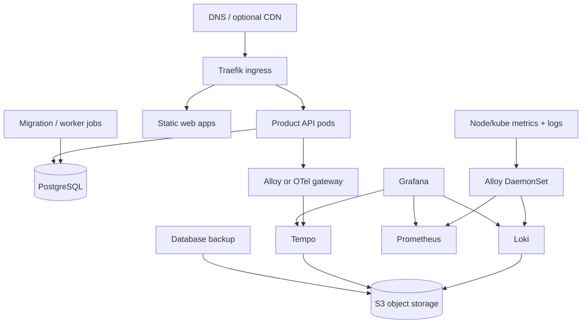

# Shared application platform analysis

**Projects reviewed:** Fitness Tracker, OpenDialog, and the Solo Leveling backend  
**Review date:** 2026-08-07  
**Scope note:** The Solo Leveling frontend is intentionally excluded because it is being rewritten.

## Executive summary

The three projects already share enough architecture to justify a common foundation. They do not yet justify a large framework or a single mega-repository.

The best common starting point is assembled from different projects:

- **Solo Leveling** has the strongest Rust package boundaries and is the best model for the backend workspace.
- **OpenDialog** has the strongest frontend monorepo and reusable-package layout.
- **Fitness Tracker** has the most complete end-to-end operational setup and the strongest analytics privacy controls.

The recommended end state is:

1. Keep each product in its own product monorepo.
2. Extract a small, versioned Rust application kit for runtime, configuration, HTTP conventions, health/readiness, telemetry, and testing.
3. Extract provider-neutral TypeScript packages for analytics, API access, storage contracts, and design tokens. Do not try to share all UI.
4. Default authentication to self-hosted Keycloak behind the shared identity port, with Clerk and WorkOS available as configurable provider adapters.
5. Create a declarative project generator that composes those packages and deployment templates, and treat fleet-wide upgrades of generated applications as a first-class platform feature.
6. Run applications on a deliberately non-HA, single-node K3s cluster while they are personal/low-traffic projects. Self-host PostgreSQL with CloudNativePG and own the backups; managed PostgreSQL is a documented future option, not a near-term step.
7. Start observability with Grafana, Alloy, Prometheus, monolithic Loki, and monolithic Tempo. Do not start with distributed Mimir. Add Mimir only when long retention, multiple tenants, or metric volume makes it useful.
8. Keep application OpenTelemetry instrumentation as the primary signal. Pilot Grafana Beyla as an eBPF baseline for uninstrumented traffic, but do not treat it as binary injection or a replacement for domain instrumentation.
9. Run self-hosted PostHog on its own dedicated server, separate from the application cluster, with one PostHog project per product and the provider-neutral analytics interface as the exit path.
10. Keep everything private initially: private GitHub repositories under the personal account (`patrickkoss`), with git-based dependencies for both Rust crates and TypeScript packages, and no registry involved at all. Open-source the reusable runtime, contracts, CLI, Helm chart, dashboards, and agent skills only once the foundation has proven itself across real applications. Keep the hosted control plane, managed upgrades, secrets, backups, billing, and support as the potential paid product.

The most valuable near-term work is not building a PaaS. It is extracting and dogfooding the common contracts across a fourth application; the architecture health platform is the chosen dogfood target. A hosted platform becomes justified only after those contracts survive several real upgrades.

## 1. How the projects compare

### 1.1 Repository-level summary

| Concern | Fitness Tracker | OpenDialog | Solo Leveling backend | Recommended source |
|---|---|---|---|---|
| Rust structure | One crate with internal `domain`, `ports`, `adapters`, and `services` modules | Workspace with domain, ports, services, adapters, and compiler crates | Workspace with domain, ports, services, API, adapters, and composition/binary crate | Solo Leveling |
| Mobile | Expo SDK 57, Expo Router, offline-first | Expo SDK 57, flatter screen structure, offline-first | Excluded | Fitness Tracker routing + OpenDialog packages |
| Web | Expo web/PWA | Separate Vite/React/Tailwind PWA | Excluded | OpenDialog, with TanStack Router added |
| Frontend packages | Mostly app-local | pnpm/Turbo packages for analytics, API, auth, data, domain, sync, UI, and tokens | Excluded | OpenDialog |
| Offline model | Revision cursor, full-row synchronization, tombstones/LWW | Event log plus HLC-based state synchronization | Not a frontend concern | Share primitives, not one protocol |
| API contract | Utoipa/OpenAPI and generated TypeScript client | Utoipa/OpenAPI and generated TypeScript client | Utoipa/OpenAPI | All three |
| Telemetry | JSON tracing, OTLP traces, Prometheus, build/DB metrics | JSON tracing, OTLP traces, manual and library HTTP metrics | JSON tracing, OTLP traces, Prometheus, worker metrics | Consolidate all three |
| Local observability | Grafana, Prometheus, Loki, Tempo, Alloy, OTel Collector | Nearly the same stack | Mostly application instrumentation; less standardized deployment | Fitness/OpenDialog |
| Product analytics | PostHog wrapper, consent, identity flow, PII scrubbing | Strong provider-neutral typed analytics package | Not standardized | OpenDialog structure + Fitness privacy |
| CI/testing | Rust coverage, frontend tests, API drift, Playwright, Maestro | Similar, with workspace boundaries and ADRs | Extensive backend tests | Combine conventions |
| Agent workflows | Project instructions but no shared skills | Project instructions but no shared skills | Existing OpenSpec Claude skills and commands | Generalize Solo workflows |

Approximate scale at review time:

| Project | Rust files / lines | TypeScript files / lines | SQL migrations | OpenAPI paths / operations |
|---|---:|---:|---:|---:|
| Fitness Tracker | 139 / 59k | 369 / 92k | 17 | 63 / 99 |
| OpenDialog | 35 / 19k | 273 / 60k | 3 | 19 / 24 |
| Solo Leveling backend | 247 / 93k | Excluded | 26 | 224 / 296 |

These counts include tests and generated or supporting code, so they indicate relative maturity rather than application complexity.

### 1.2 The recurring product shape

The common architecture is already recognizable:



The repeated technical choices are substantial:

- Axum and Tokio for HTTP and async runtime.
- SQLx and PostgreSQL for persistence and migrations.
- Serde, Chrono, UUID, `thiserror`, `reqwest`, and JWT handling.
- Domain/ports/services/adapters boundaries.
- Utoipa-generated OpenAPI and generated TypeScript clients.
- `tracing` plus OpenTelemetry/OTLP for traces.
- `metrics` plus Prometheus exposition.
- A separate operations listener for liveness, readiness, and metrics.
- JSON logging, request IDs, W3C trace propagation, graceful shutdown, and build metadata.
- Testcontainers for integration tests.
- Expo/React Native, TanStack Query, Zustand, and offline persistence.
- PostHog for product analytics.
- Playwright for web end-to-end tests and Maestro for native flows.

This is the stable core to standardize.

### 1.3 Library and tool inventory

The precise dependency versions will keep moving; the useful abstraction is the responsibility each dependency owns. At review time the common backend stack is:

| Responsibility | Current libraries | Use in a shared baseline |
|---|---|---|
| Async/runtime | Tokio | Standardize |
| HTTP | Axum 0.8, Tower, Tower HTTP | Standardize one layer order and default policy |
| Persistence | SQLx 0.9 with PostgreSQL | Standardize pool/config/migration/testing mechanics, not repositories |
| Serialization/time/IDs | Serde, `serde_json`, Chrono, UUID | Standardize; prefer UUIDv7 for new sortable entity IDs where appropriate |
| Errors | `thiserror`; some boundary use of general errors | Typed domain/service errors and one HTTP error mapping |
| Outbound HTTP | Reqwest with Rustls | Shared timeout/retry/TLS conventions; provider calls stay in adapters |
| Auth | `jsonwebtoken`, JWKS over HTTP; Clerk/Keycloak at product edges | Standard identity port and OIDC verifier, provider adapters optional |
| API description | Utoipa 5 and `utoipa-axum` where used | Standardize OpenAPI generation and drift checks |
| Metrics | `metrics`, `metrics-exporter-prometheus`, sometimes `axum-prometheus` | Keep `metrics`; replace competing HTTP recorders with one baukit middleware |
| Traces/logs | `tracing`, `tracing-subscriber`, OpenTelemetry 0.32, OTLP | Standardize initialization, resource attributes, propagation, flush, and redaction |
| Configuration | `config` + `dotenvy` in two projects; Figment in OpenDialog | Select one public configuration convention |
| Integration tests | Testcontainers, Tower request tests, SQLx migrations | Extract shared fixtures and conformance tests |
| Property tests | Proptest in the larger workspaces | Retain for clocks, merge logic, identifiers, and invariants |
| Secrets/crypto | `zeroize`, AES-GCM, HMAC, SHA, provider-specific crypto | Share redacted secret wrappers only; keep protocols local |

The frontend/tooling inventory is:

| Responsibility | Fitness Tracker | OpenDialog | Recommended baseline |
|---|---|---|---|
| Mobile runtime | Expo 57.0.9, React Native 0.86.2, React 19.2.3 | Same | Keep Expo-compatible versions centrally pinned |
| Navigation | Expo Router | Custom/flatter screens | Expo Router for mobile |
| Remote state | TanStack Query 5.101.4 | Same | Standardize |
| Local state | Zustand 5.0.14 | Same | Use selectively; do not mirror query data |
| Native persistence | Expo SQLite | Expo SQLite | Shared contracts, product schemas |
| Web persistence | Dexie/IndexedDB | Dexie through data adapter | Shared contracts and conformance suite |
| Web build/style | Expo web | Vite 8, Tailwind 4, PWA plugin | Vite/Tailwind for web-only; optional PWA |
| Web routing | Expo Router | Custom routing | TanStack Router for the new web template |
| Auth client | Clerk Expo and auth-session | Clerk React/OIDC adapters | Product-neutral auth package plus adapters |
| Analytics | PostHog React Native | PostHog web/native transports behind a port | Shared typed core and separate transports |
| Error capture | Sentry React Native | No equivalent common package | Thin shared port; provider-native setup |
| Unit/component tests | Jest/RNTL | Vitest/RNTL and Testing Library | One runner per generated target; shared behavior fixtures |
| End-to-end | Playwright and Maestro | Playwright and Maestro | Standardize critical-path suites |
| Workspace/build | App-local npm setup | pnpm 11 and Turbo 2 | pnpm/Turbo for multi-app products |
| Formatting/lint/types | ESLint, Prettier, TypeScript | Same families | Shared configs with target-specific rules |

Supporting operational tools already present or strongly implied by the repositories include Docker/Compose, multi-stage Dockerfiles, Make targets, GitHub Actions, OpenAPI client generation, Expo Doctor, Rustfmt, Clippy, LLVM coverage/nextest, Playwright, Maestro, Grafana provisioning, and database migration/seed binaries. These should become generator capabilities and CI presets rather than copied YAML and Make recipes.

## 2. Project findings

### 2.1 Fitness Tracker

#### What is strong

The backend is logically hexagonal even though it is one Cargo crate. The `domain`, `ports`, `services`, and `adapters` modules give it a migration path to a workspace without requiring a rewrite. Its runtime is particularly complete:

- API and operations traffic use separate listeners.
- Shutdown drains cleanly on process signals.
- Metrics include HTTP, build, and database-pool state.
- Traces use W3C propagation and OTLP.
- Logs are structured and carry trace correlation.
- OpenAPI is generated from backend definitions.

The frontend has the clearest mobile application convention of the three:

- Expo Router provides file-based navigation.
- TanStack Query owns remote/server state.
- Zustand owns local interaction state.
- Native SQLite and web Dexie provide platform-specific persistence.
- Contract tests hold the two persistence implementations to the same behavior.
- Components are insulated from direct API calls by the data/sync layer.

Fitness Tracker also has the best analytics/privacy baseline. It asks for consent, separates anonymous and identified use, identifies by an internal UUID, and scrubs sensitive properties. This should be preserved in any shared package.

#### What should change

The backend has become too large for one crate. Internal modules provide conceptual boundaries, but Cargo cannot enforce them. New applications should begin with separate crates, and Fitness Tracker can migrate incrementally when the benefit outweighs the churn.

The frontend contains reusable concepts but fewer explicit package boundaries than OpenDialog. Analytics, API runtime, storage contracts, and sync primitives should gradually move behind packages.

Its Docker runtime contains the API, migrator, and integration worker. That is convenient but makes every deployment carry all binaries. Separate runtime images or build targets would make releases smaller and permissions clearer.

### 2.2 OpenDialog

#### What is strong

OpenDialog is the closest current example of the desired product monorepo. Its backend separates:

- `domain`
- `ports`
- `services`
- HTTP, PostgreSQL, auth, ElevenLabs, and LLM adapters
- a content compiler
- a root composition/server package

Its frontend is the strongest source for a reusable application layout:

```text
frontend/
  apps/
    mobile/
    web/
  packages/
    analytics/
    api-client/
    auth/
    data/
    domain/
    mcp-server/
    sync/
    ui/
    ui-tokens/
  e2e/
  pnpm-workspace.yaml
  turbo.json
```

The `data` package is especially useful because it defines storage contracts and tests multiple implementations: Expo SQLite, Dexie, and Node SQLite. The analytics package also has the right basic shape: typed event unions, a provider-neutral interface, no-op/testability support, explicit consent, and identity transitions.

The offline model is sophisticated and appropriate for its domain. Immutable learning events avoid unnecessary conflicts; HLC-based last-write-wins state handles settings and mutable state. Cross-language parity tests are a good practice.

#### What should change

The mobile navigation structure is less conventional than Fitness Tracker’s Expo Router structure. A standard template should use Expo Router unless a product has a concrete reason not to.

The web app is Vite/React/Tailwind but does not yet use TanStack Router. For a web-only Rust-backed SPA, Vite plus TanStack Router, TanStack Query, and Tailwind is a coherent default.

Backend configuration uses Figment while the other projects use `config` plus `dotenvy`. Both work; maintaining both in the shared foundation does not add value. Choose one configuration contract and one error format.

The HTTP telemetry appears to combine custom RED middleware with `axum-prometheus`. That risks duplicate observations and divergent labels. The shared runtime should own HTTP metrics exactly once.

OpenDialog constrains analytics properties through types, but Fitness Tracker’s explicit sensitive-property scrubber is a stronger last line of defense. The shared package should contain both.

### 2.3 Solo Leveling backend

#### What is strong

Solo Leveling has the most enforceable backend architecture:

```text
backend/
  crates/
    sl-domain/
    sl-ports/
    sl-services/
    sl-api/
    sl-postgres/
    sl-integrations/
    sl-notifications/
    sl-ai/
    sl-bin/
```

The dependency direction is approximately:

```text
domain <- ports <- services <- API/composition
                       ^
                       |
             concrete adapters
```

The composition crate exposes distinct API, worker, migration, OpenAPI, and seed binaries. This is the best template for future backends because it makes process responsibilities explicit without duplicating business logic.

It also has mature operational details worth extracting:

- redacted secret types and startup validation;
- a separate operations listener;
- graceful shutdown;
- API and background-worker metrics;
- generated OpenAPI;
- integration adapters isolated from the domain.

Solo Leveling is the only project with a meaningful set of Claude/OpenSpec skills. The workflows are useful, although duplicated command and skill definitions should not become the long-term distribution model.

#### What should change

Metrics are prefixed with application-specific names while the other projects use generic HTTP names. Status labels and duration names also differ. Those differences defeat one shared dashboard and alert pack.

The root workspace is a good template, but domain-specific crates such as AI, notifications, and integrations should remain optional generated features rather than mandatory application-kit dependencies.

The current working tree contains an active backend rewrite. This analysis treats it as evidence only and does not propose mechanical extraction from those uncommitted files.

## 3. The target product repository

Each application should remain independently buildable and releasable. A recommended product structure is:

```text
product-name/
  backend/
    Cargo.toml
    crates/
      product-domain/
      product-ports/
      product-services/
      product-api/
      product-postgres/
      product-integrations/       # optional
      product-worker/             # optional logic/library
      product-bin/                # api, worker, migrate, openapi, seed
    migrations/
    tests/
  frontend/
    apps/
      mobile/                     # optional Expo app
      web/                        # optional Vite SPA
    packages/
      analytics/
      api-client/
      auth/
      data/
      domain/
      sync/                       # optional, product-specific policy
      ui-tokens/
    e2e/
    pnpm-workspace.yaml
    turbo.json
  deploy/
    chart/                        # thin values/wrappers over shared chart
    environments/
      local.yaml
      staging.yaml
      production.yaml
  docs/
    adr/
    operations/
  .agents/skills/                 # Codex discovery path
  .claude/skills/                 # Claude discovery path or installed copies
  baukit.toml
  Makefile
```

Important rules:

- `domain` contains business rules and no Axum, SQLx, PostHog, or cloud SDKs.
- `ports` contains interfaces and boundary types.
- `services` implements use cases against ports.
- adapters implement ports and own provider details.
- `api` owns HTTP DTOs, routing, auth extraction, error mapping, and OpenAPI.
- `bin` is composition and process lifecycle only.
- migrations live with the backend but run as a release job, not implicitly during API startup.
- the generated TypeScript schema/client is checked for drift in CI.
- optional apps and packages are omitted, not left as empty scaffolding.

This structure is deliberately a template, not a mandatory universal workspace. Small experiments may start with fewer crates, but their module dependency direction should match it.

## 4. Shared libraries to extract

### 4.1 Rust crates

The kit is named `baukit` (see the [conventions document](./platform/baukit-conventions.md) for the naming decision and registration steps). The crate names below describe the responsibility each one owns.

#### `baukit-runtime`

Own only process-wide mechanics:

- startup metadata and validated environment;
- graceful shutdown token and drain timeout;
- task supervision;
- standard service identity and build information;
- helpers for composing API and operations listeners.

It should not own product configuration fields, database schemas, or routing.

#### `baukit-config`

Provide a narrow contract for layered configuration:

- defaults, optional local file, and environment overrides;
- a consistent environment-variable prefix convention;
- secret wrappers with redacted `Debug` and zeroization where useful;
- startup validation with actionable errors;
- standard fields for HTTP, operations, database, telemetry, and shutdown.

Choose either `config` or Figment internally. The public value is the convention, not support for two loaders. `config` aligns with two of the three current backends and is the lower-migration choice.

#### `baukit-http`

Provide the shared Axum layer stack:

- request IDs and propagation;
- trace context extraction/injection;
- route-template-aware request spans;
- panic handling;
- CORS, timeout, body-size, and concurrency defaults;
- a stable JSON problem/error envelope;
- graceful drain behavior;
- standard HTTP RED metrics recorded exactly once.

Authentication should remain a port plus optional adapter crates. The core must not depend on Clerk or Keycloak.

#### `baukit-ops`

Provide a separate operations router and readiness registry:

- `/healthz`: process is alive;
- `/readyz`: required dependencies are usable and the service accepts traffic;
- `/metrics`: Prometheus exposition;
- build/version information;
- extensible readiness checks with timeouts;
- optional database pool metrics.

Keep it on a separate listener and do not expose it through the public ingress by default.

#### `baukit-telemetry`

Provide the standard observability contract:

- structured JSON logs in deployed environments and readable local logs;
- OTLP trace export;
- W3C Trace Context propagation;
- resource attributes such as service, version, and environment;
- Prometheus metrics recorder;
- safe filtering and explicit shutdown/flush;
- standard metric names and bounded labels.

Do not hide all OpenTelemetry primitives. Products still need to add spans and metrics for domain workflows.

#### `baukit-openapi`

Keep this small:

- standard Utoipa metadata and security schemes;
- deterministic serialization;
- a binary/helper for writing the schema;
- CI comparison utilities.

The product owns endpoint schemas. The TypeScript generator can live in the CLI rather than the Rust crate.

#### `baukit-test`

High-value shared test support includes:

- PostgreSQL Testcontainers setup and migration lifecycle;
- authenticated request fixtures;
- test tracing initialization;
- health/readiness conformance tests;
- OpenAPI snapshot/drift assertions;
- port contract-test helpers.

Test support is a better early extraction target than a generic repository abstraction because it standardizes behavior without constraining product models.

### 4.2 TypeScript packages

#### `@baukit/analytics-core`

Build this from OpenDialog’s package structure and Fitness Tracker’s privacy behavior:

- generic, typed event schema;
- provider-neutral transport;
- no-op and in-memory test transports;
- consent state machine;
- anonymous-to-known identity transition and logout reset;
- event/property allowlists and a final PII scrubber;
- common context: app, version, platform, environment, release, locale;
- `schema_version` on every event;
- bounded buffering and failure that never blocks the user journey.

Provider packages can include `@baukit/analytics-posthog-web` and `@baukit/analytics-posthog-native`. Product-specific event names should remain in the product package.

#### `@baukit/api-runtime`

Wrap `openapi-fetch` or the chosen generated client with:

- base URL and environment resolution;
- access-token injection;
- request ID and trace header support where appropriate;
- normalized API errors;
- safe retries for idempotent requests only;
- test transport/mocking hooks.

The generated schema remains product-specific.

#### `@baukit/data-contracts`

OpenDialog’s storage conformance approach is worth generalizing:

- transaction, pagination, and atomicity contracts;
- Expo SQLite, Dexie, and Node test adapter helpers;
- reusable contract-test suites;
- schema/version metadata conventions.

Do not place product entities in the shared package.

#### `@baukit/ui-tokens`

Share design tokens and their compiler, not an ambitious cross-platform component library:

- color, typography, space, radius, motion, and elevation schema;
- generated CSS variables for web;
- generated typed constants for React Native;
- theme validation and accessibility checks.

React Native and DOM components diverge in behavior, accessibility, and layout. Share headless logic or tokens only where this is honest.

#### Error reporting

Fitness Tracker already uses Sentry. Define a tiny error-reporting interface for application code, but keep native crash capture and source-map/symbol upload in provider-specific setup. Product analytics, logs, and crash reporting solve different problems and should not be merged.

### 4.3 Additional capability ports

Nearly every generated application will eventually need these. Deciding them once avoids re-litigating them per app:

- **Transactional email:** a small email port with provider adapters. Start with a hosted API provider adapter for deliverability, and keep a self-hosted SMTP option (for example Stalwart) available; sending-domain reputation is the hard part, not the software.
- **Push notifications:** Expo push notifications as the default mobile path behind a thin port; web push is optional per product.
- **File/object storage:** an S3-compatible storage port with adapters for Hetzner Object Storage or MinIO, plus presigned-upload conventions.
- **Background jobs:** standard conventions for the worker binary: job storage choice, retry/backoff policy, idempotency keys, and the worker metrics already defined in the telemetry contract.

Each follows the same rule as auth and analytics: the port is shared, the adapter is chosen per product, and no core crate depends on a provider SDK.

### 4.4 What not to abstract yet

Avoid extracting these prematurely:

- a generic domain/repository framework;
- one universal synchronization engine;
- a universal UI component library across React Native and the DOM;
- provider-specific auth semantics;
- content compilation, fitness calculations, gamification, AI, or notification policy;
- a dynamic Rust plugin ABI.

The two offline protocols demonstrate why restraint matters. Fitness Tracker uses per-user revision cursors, full-row synchronization, tombstones, and field authority rules. OpenDialog uses immutable event facts plus HLC/CAS merging for mutable state. They share clocks, identifiers, storage contracts, and test ideas, but not one conflict policy. Extract an HLC crate or sync test harness only after the interfaces are proven in more than one product.

## 5. Standard contracts

### 5.1 API and errors

Every service should expose one consistent error envelope, for example:

```json
{
  "error": {
    "code": "validation_failed",
    "message": "The request is invalid",
    "request_id": "...",
    "details": {}
  }
}
```

Rules:

- `code` is stable and machine-readable.
- `message` is safe to show or intentionally generic.
- validation details are structured.
- internal causes never cross the public boundary.
- the same request ID appears in logs and support tooling.
- OpenAPI documents all error variants.

### 5.2 Identity

The backend should implement an OIDC/JWT verification port with provider adapters. Self-hosted Keycloak is the default provider; Clerk and WorkOS are configurable adapters behind the same port, so a product can opt into a hosted provider without touching domain code. Domain and service code receive an internal principal, never provider-specific claims. Standardize:

- subject-to-internal-user mapping;
- issuer/audience validation;
- JWKS caching and rotation;
- organization/tenant context as an optional separate concept;
- anonymous/product-analytics identifiers that are not authentication identifiers.

### 5.3 Database and migrations

- PostgreSQL is the common system of record.
- Use a separate database and role per product, even on one PostgreSQL cluster.
- Migrations run as a release job with an advisory lock and timeout.
- API startup verifies compatibility but does not race to migrate.
- Backward-compatible expand/migrate/contract changes enable rolling releases.
- Every production database has off-machine WAL/base backups (CloudNativePG's barman-based object-store backups) and a scheduled restore test, at least monthly, that alerts when stale.

### 5.4 Rust dependency policy

All three lockfiles contain roughly 400–450 distinct packages. A shared workspace-dependency catalog can reduce accidental divergence, but a global lockfile across unrelated products would couple releases unnecessarily.

Recommended policy:

- publish shared crates with SemVer and an explicit minimum supported Rust version;
- use Renovate or Dependabot for grouped ecosystem updates;
- maintain a tested compatibility matrix for Axum, SQLx, OpenTelemetry, and Utoipa;
- deny unsafe code in the shared core unless a narrow crate documents why it is necessary;
- run `cargo deny`/`cargo audit`, license checks, formatting, Clippy, tests, and minimal-version/MSRV jobs as appropriate;
- generate an SBOM and sign released images.

## 6. Frontend baseline

### 6.1 Mobile default

Use:

- Expo SDK 57 and its supported React Native/React versions at the time of generation;
- Expo Router for file-based navigation;
- TanStack Query for remote state;
- Zustand only for local UI/workflow state;
- Expo SQLite for offline persistence;
- generated OpenAPI types/client;
- typed analytics and error reporting adapters;
- Jest/React Native Testing Library plus a small Maestro critical-path suite.

Expo officially supports monorepos with pnpm and other package managers, but native packages must not be duplicated. Keep React, React Native, and Expo dependency resolution centralized and verify with Expo Doctor. See the [Expo monorepo guide](https://docs.expo.dev/guides/monorepos/) and [Expo Router documentation for SDK 57](https://docs.expo.dev/versions/v57.0.0/sdk/router/).

### 6.2 Web-only default

For an authenticated application whose backend is Rust, use:

- Vite;
- React;
- TanStack Router with generated/file-based routes;
- TanStack Query;
- Tailwind CSS 4;
- Dexie only when offline behavior is required;
- Vitest/Testing Library and Playwright.

This avoids adding a second server runtime. Use TanStack Start only when the product needs SSR, server functions, streaming, or SEO that a static SPA cannot provide. As of this review TanStack Start is still presented as a release candidate, so it should be an explicit option rather than the default. See the [TanStack Start overview](https://tanstack.com/start/latest/docs/framework/react/overview) and [Tailwind’s Vite setup](https://tailwindcss.com/docs/installation/using-vite).

### 6.3 Sharing between mobile and web

Share:

- domain types and pure validation;
- generated API schema;
- analytics contracts;
- storage interfaces and sync protocol logic;
- design tokens;
- pure view-model/state-machine logic.

Usually keep separate:

- DOM and React Native components;
- navigation shells;
- accessibility interactions;
- persistence adapters;
- native integrations and web service workers.

This gives useful reuse without forcing the lowest common denominator.

## 7. Cheap hosting architecture

### 7.1 Resource sizing

There is no artificial per-container size or bandwidth budget. Applications take the resources they need; Rust services and static frontends are naturally small, so container size is not a cost driver worth engineering against. For reference, locally observed runtime images were approximately 92–179 MB, and the build hygiene in 7.5 will shrink that as a side effect.

What matters is measurement and honest requests/limits:

- Track compressed registry transfer, uncompressed node storage, and runtime resident memory as three separate numbers; optimizing one does not guarantee the others.
- Start small APIs at a measured 64 MiB request/128 MiB limit, load-test, and adjust from observed p99 working sets rather than guesses. Overly tight limits create avoidable OOM restarts.
- Watch image size and RSS trends in CI as regressions to notice, not as hard gates.

### 7.2 Initial deployment

A cost-conscious starting architecture is:



Recommended components:

- one 4–8 vCPU, 16 GB RAM SSD server in Germany/EU;
- K3s with the bundled Traefik ingress initially;
- cert-manager and automated DNS/TLS;
- Flux CD for GitOps reconciliation;
- Helm charts with one shared application chart;
- SOPS with age for Git-encrypted secrets at first;
- a container registry such as GHCR;
- one PostgreSQL cluster with separate databases/roles for personal apps;
- S3-compatible off-machine backups;
- resource requests, limits, quotas, and default-deny network policies.

K3s itself has low minimum requirements, but those requirements exclude application and observability workloads. Grafana, logs, traces, PostgreSQL, builds, and page cache—not the Kubernetes control plane—will determine the server size. K3s recommends SSD storage; its production guidance also distinguishes single-server deployments from high-availability configurations. See the [K3s requirements](https://docs.k3s.io/installation/requirements).

#### Illustrative monthly budget

As of 2026-08-07, Hetzner's published June 2026 price adjustment lists a Germany/Finland shared x86 CX43 at €15.99/month excluding VAT and a 16 GB ARM CAX31 at €20.99/month excluding VAT; both are listed as 8 vCPU/16 GB plans. ARM is not automatically cheaper here and requires multi-architecture images. See the [official price adjustment](https://docs.hetzner.com/general/infrastructure-and-availability/price-adjustment/) and [current plan specifications](https://www.hetzner.com/european-cloud/).

A realistic personal-platform budget is therefore roughly **€25–45/month before VAT** for the application node, composed of one node, IPv4 if required, a modest volume or snapshot allocation, object storage/backups, and a small margin for DNS/egress. Self-hosted PostHog adds a second dedicated server at its documented baseline (roughly another €16–21/month at current Hetzner pricing), bringing the total planning envelope to about **€45–70/month before VAT**. This is a planning envelope, not a quote. Managed PostgreSQL, high availability, or meaningful telemetry volume can increase it substantially. Track actual spend per product from the first deployment.

This is intentionally not highly available. A single node has a clear failure domain and can be acceptable for personal/beta products if:

- recovery steps are scripted;
- DNS and infrastructure can be recreated from code;
- database and object-store backups are off-machine;
- restore tests are performed;
- the expected recovery time is documented honestly.

When revenue or user expectations require high availability, move PostgreSQL to a managed service first, then move to at least three control-plane nodes or a managed Kubernetes service. Do not spread a tiny workload across three servers merely to claim HA while leaving the database, storage, or backups as single points of failure.

### 7.3 PostgreSQL choices

The decision is to self-host: a CloudNativePG-managed PostgreSQL instance on the cluster, with backups going off-machine through CNPG's barman-based object-store integration and restore exercised on a schedule. It still fails with the node; that is an accepted trade-off for personal/low-traffic products with a tested recovery path.

Managed PostgreSQL is a documented future option, not a near-term step. Revisit it when there are paying customers whose data should not share the platform's blast radius, or when backup/failover work measurably crowds out product work. Even then, retain independent logical/export recovery procedures appropriate to the provider.

### 7.4 Object storage

Use S3-compatible storage for PostgreSQL backups and, once enabled, Loki/Tempo/Mimir blocks. Keep storage in the same region when possible and test lifecycle/deletion policies.

Cloudflare R2 publishes a low storage price and no internet egress charge, while Hetzner Object Storage is S3 compatible and can reduce transfer cost when compute is in the same location. The operational choice should be made from the current regional calculator and a restore/latency test, not headline price alone. See [Cloudflare R2 pricing](https://developers.cloudflare.com/r2/pricing/) and [Hetzner Object Storage](https://docs.hetzner.com/storage/object-storage/overview/).

### 7.5 Container-size work

The highest-impact changes are:

1. Build one runtime image per process: API, worker, migrator, and seed utility.
2. Use a multi-stage build and copy only the binary, CA certificates, timezone data if required, and necessary migration assets.
3. Enable `strip`, LTO, fewer codegen units, and optionally `panic = "abort"` after validating behavior.
4. Compare a minimal glibc/distroless or Wolfi image with a static musl image; TLS, DNS, allocator, and native dependency behavior must be tested.
5. Move migrations to their release-job image rather than bundling them in every API replica.
6. Measure both image and memory regression in CI.

There is no hard size requirement. Track sizes on individual production images, not the developer/e2e images, and treat growth as a regression to investigate. Security patch cadence and debuggability matter more than saving the final few megabytes. Use `cargo-chef` in the multi-stage build so dependency layers cache across CI runs; it improves build times far more than it changes image size.

### 7.6 Node security baseline

A single public node run by one person needs an explicit hardening floor, and it is part of the open-source infrastructure story rather than an afterthought:

- SSH: key-only authentication, no root login, and a Hetzner cloud firewall restricting SSH/management access.
- OS: unattended security upgrades, with kured or a maintenance-window script for coordinated reboots.
- Ingress: Traefik rate limiting and connection limits as default middleware; fail2ban or CrowdSec in front of SSH and optionally the ingress.
- Kubernetes: default-deny network policies, the operations listener kept off the public ingress, and image signature/provenance checks once images are published.
- Secrets: SOPS with age in Git initially; evaluate external-secrets only when a real external secret store exists.

### 7.7 CI and build infrastructure

Rust CI time on private repositories consumes GitHub's free tier of 2,000 Actions minutes per month. Start on GitHub-hosted runners and treat self-hosting as a triggered upgrade, not a day-one build:

- `cargo-chef` in Dockerfiles for dependency-layer caching and `sccache` or persistent target-dir caching for test jobs, from the start; caching is what keeps the fleet under the free tier.
- Track monthly Actions usage; adopt self-hosted runners (dedicated cheap server or actions-runner-controller on the cluster) only once usage approaches the free 2,000 minutes.
- Renovate via the free hosted app or a scheduled Actions workflow initially; self-host it later alongside the runners if usage or control demands it.
- Reusable workflow definitions distributed by the generator, not copied YAML.

## 8. Observability

### 8.1 Current state

Fitness Tracker and OpenDialog already run nearly identical local stacks:

- Grafana;
- Prometheus;
- Loki;
- Tempo;
- Alloy for Docker log collection;
- OpenTelemetry Collector for traces.

Both have useful dashboards, but the signal contract differs:

| Signal | Fitness Tracker | OpenDialog | Solo Leveling |
|---|---|---|---|
| Request count | `http_requests_total` | `http_requests_total` | app-prefixed name |
| Duration | plural `http_requests_duration_seconds` | singular `http_request_duration_seconds` | app-prefixed name |
| Status | raw status | raw status | status class |
| Log service label | commonly `service_name` | commonly `service` | separate setup |
| HTTP implementation | metrics layer with normalization | custom middleware plus metrics layer | custom telemetry |

This is enough divergence to make a common dashboard unreliable. Standardizing the telemetry contract is more important than choosing another backend.

### 8.2 Recommended initial stack

Use:

- **Grafana** for dashboards, Explore, and alerting;
- **Prometheus** as a single metrics store initially;
- **Loki in monolithic mode** for logs;
- **Tempo in monolithic mode** for traces;
- **Grafana Alloy** as the Kubernetes node/log collector and optionally the OTLP gateway;
- `kube-state-metrics` plus kubelet/cAdvisor/node metrics;
- S3-compatible object storage when retention moves beyond local disk.

Loki documents monolithic mode as appropriate for small volumes, including installations below roughly 20 GB/day. Its older “simple scalable” mode is being deprecated before Loki 4, so starting new on monolithic and later moving to microservices is clearer. See [Loki deployment modes](https://grafana.com/docs/loki/latest/get-started/deployment-modes/).

Do **not** deploy the full distributed Mimir stack initially. Mimir is valuable for durable, horizontally scalable, multi-tenant Prometheus metrics, but its microservice mode creates a meaningful number of components and operational overhead. Grafana documents monolithic mode for simple/test use and microservices mode for larger production deployments; its sizing guidance assumes resources beyond the datastore alone. See [Mimir deployment modes](https://grafana.com/docs/mimir/latest/references/architecture/deployment-modes/) and [Mimir hardware requirements](https://grafana.com/docs/mimir/latest/set-up/hardware-requirements/).

Adopt Mimir when one or more become true:

- metrics must survive replacement of the single cluster/node;
- retention becomes long enough that local Prometheus storage is awkward;
- independent users/tenants need isolation;
- query or ingestion load needs horizontal scaling;
- the hosted platform needs a central metrics plane across clusters.

At that point, start with a monolithic Mimir deployment backed by object storage and only split it when measured load requires it. A single-node VictoriaMetrics deployment is also worth benchmarking as a cost-focused metrics alternative, but it would make the platform less uniformly Grafana-stack-native.

### 8.3 Collector topology

The current combination of Alloy for logs and OpenTelemetry Collector for traces is valid, but responsibilities should be explicit. A small cluster can use:

- Alloy DaemonSet: container logs, host/Kubernetes metrics, local discovery;
- one Alloy or OpenTelemetry gateway: OTLP ingest, resource normalization, filtering, batching, and sampling;
- direct Prometheus scraping for application `/metrics` endpoints.

Do not make every signal traverse both collectors. The platform chart should choose one gateway implementation and generate the application endpoint/environment variables.

### 8.4 A common telemetry contract

Use OpenTelemetry semantic-convention attribute names where practical and keep Prometheus compatibility stable. Every service should set:

- `service.name`
- `service.version`
- `deployment.environment.name`
- product/team identity
- Kubernetes namespace, workload, pod, and cluster at collection time

HTTP measurements should use bounded attributes such as:

- `http.request.method`
- `http.response.status_code`
- `http.route` using the matched route template

Never use raw URL paths, user IDs, email addresses, tokens, arbitrary error text, trace IDs, or request IDs as metric labels. They cause cardinality growth or leak sensitive data.

The baseline signals should include:

- request rate, error rate, and duration histogram;
- in-flight requests;
- database pool size, idle/in-use connections, waits, and acquisition duration;
- process CPU/memory/file descriptors;
- worker attempts, successes, failures, duration, retry count, and queue age;
- build/version information;
- application-specific synchronization lag/conflicts/failures.

Record domain metrics in product code. Do not turn product analytics events into Prometheus labels.

### 8.5 Logs and traces

- Log JSON in deployed environments.
- Put request/trace correlation in fields, but keep high-cardinality IDs out of Loki labels.
- Scrub authorization headers, cookies, emails, tokens, request bodies, and provider payloads by default.
- Sample successful high-volume traces; retain errors and high-latency traces more aggressively.
- Add exemplars from request-duration metrics to traces when supported.
- Start with explicit budgets, for example 30 days of metrics, 14 days of logs, and 7 days of traces, then adjust from observed cost and incident value.

### 8.6 Alerts and dashboards as code

The shared distribution should include dashboards, recording rules, and alerts—not only collectors. The minimum alert pack should cover:

- availability and multi-window 5xx error-budget burn;
- p95/p99 latency;
- readiness failures and missing scrape targets;
- crash loops, OOM kills, and pod restarts;
- CPU throttling and memory pressure;
- PostgreSQL pool saturation and connection failures;
- persistent-volume/disk pressure;
- stale or failed backups and restore-test age;
- certificate expiry;
- worker failures, retry storms, and queue age;
- offline-sync failure and lag;
- an external synthetic check and a dead-man/no-data alert.

Create a dashboard contract test or at least CI linting that verifies all referenced metric names against the shared telemetry package. The current singular/plural duration mismatch is exactly the kind of drift this prevents.

## 9. eBPF: useful baseline, not binary injection

Grafana Beyla can observe Rust HTTP/gRPC applications with eBPF and emit OpenTelemetry metrics and traces without changing application source. It can run as a Kubernetes DaemonSet or beside a workload. See the [Beyla Rust quick start](https://grafana.com/docs/beyla/latest/quickstart/rust/) and [Beyla overview](https://grafana.com/oss/beyla-ebpf/).

This is not normally “injecting something into the binary.” It observes kernel/user-space activity from a privileged agent. That distinction matters because Beyla requires Linux capabilities and access that increase the node-level blast radius. Grafana documents capabilities such as BPF, performance monitoring, network administration, and process tracing depending on the configuration. See [Beyla security considerations](https://grafana.com/docs/beyla/latest/security/).

Recommended use:

- pilot it in staging as a node DaemonSet;
- grant only the documented capabilities required for the chosen mode;
- use it to cover uninstrumented services, third-party workloads, and network relationships;
- compare route quality and overhead against in-process Axum instrumentation;
- choose one owner for HTTP request metrics/traces to avoid duplicate series and spans.

Keep in-process instrumentation because eBPF cannot understand:

- synchronization conflicts or cursor lag;
- database-pool intent;
- queue/job semantics;
- provider retry behavior;
- safe domain span names;
- product/business events;
- browser or mobile behavior.

For these Rust services, which are already instrumented, eBPF is a safety net and discovery tool rather than the primary observability strategy.

## 10. Product analytics

### 10.1 A shared event contract

Define product analytics independently of PostHog:

```ts
type AnalyticsEvent =
  | { name: "onboarding_started"; properties: { source: string } }
  | { name: "onboarding_completed"; properties: { durationSeconds: number } };

interface AnalyticsPort<E> {
  capture(event: E): void;
  identify(userId: string, traits?: SafeTraits): void;
  alias(anonymousId: string, userId: string): void;
  reset(): void;
  setConsent(value: "granted" | "denied" | "unknown"): void;
}
```

The exact names remain product-owned. Shared rules should require:

- documented purpose and owner for every event;
- past-tense, stable event names;
- typed and allowlisted properties;
- a schema version;
- no health, food, conversation, prompt, email, or token content by default;
- unit tests for privacy filters;
- consent behavior appropriate to the jurisdiction and data category;
- explicit retention and deletion handling.

### 10.2 Client and server events

Capture interface interactions on the client and authoritative outcomes on the backend. For example, the client may record `checkout_started`, but the backend should record `subscription_activated` after confirmed payment.

For business-critical backend events, use an outbox written in the same database transaction as the state change, then deliver asynchronously. Do not make a user request depend on the analytics provider. Ordinary UI events may use the client SDK’s queue.

Maintain a tracking plan with acquisition, activation, retention, referral, and revenue hypotheses. A shared library cannot decide the north-star metric for each product.

### 10.3 Hosting PostHog

PostHog is already used by Fitness Tracker and OpenDialog. The decision is to self-host it, in line with the platform's cost and data-control goals, but never on the application cluster. PostHog's current self-hosting documentation describes self-hosting as unsupported, follows continuous/latest releases, and gives a hobby deployment baseline of roughly 4 vCPU, 16 GB RAM, and more than 30 GB storage; new Kubernetes deployments of the paid open-source product are not supported. See [PostHog self-hosting](https://posthog.com/docs/self-host).

Concretely:

- run the PostHog hobby (Docker Compose) deployment on its own dedicated server, sized at its documented baseline;
- use one PostHog project per product; organizations and projects cover the multi-app separation need without paid multi-tenancy features;
- treat upgrades as a scheduled routine, since PostHog tracks latest continuously, and back up its data volumes like any other stateful service;
- keep the provider-neutral analytics interface so switching or exporting remains possible;
- keep it off the application cluster so an analytics-pipeline failure never affects production applications.

The attention cost of upgrades and pipeline failures is real and accepted; the provider-neutral port keeps the exit cheap if self-hosting stops being worth it.

## 11. Generator and extension system

### 11.1 Generator shape

Create a Rust CLI, `baukit`, with a declarative manifest:

```toml
[app]
name = "example"

[backend]
enabled = true
worker = true
auth = "oidc"

[frontend]
mobile = "expo"
web = "vite-tanstack"
offline = true

[analytics]
provider = "posthog"

[deploy]
target = "k3s"
```

Example commands:

```text
baukit new example --backend --mobile --web --offline
baukit add worker
baukit add integration stripe
baukit generate openapi-client
baukit doctor
baukit template-diff
baukit upgrade
```

Start with `cargo-generate` or a simple template renderer if it covers creation. A custom CLI becomes valuable for upgrades, validation, and feature composition.

### 11.2 Generator rules

- Generated applications must keep working without the CLI.
- `baukit.toml` records selected capabilities and template version.
- `new` is deterministic and tested with golden snapshots.
- `add` commands are idempotent.
- Prefer owned/generated files and structural edits over regex replacement in user code.
- Never silently overwrite a modified file; produce a diff or conflict file.
- Test a matrix of backend-only, mobile-only, web-only, and combined applications in CI.
- Generate deployment values, CI, local compose, OpenAPI scripts, and matching agent skills together.
- Use Changesets/release tooling and SemVer for shared packages.

### 11.3 Plugin model

Do not begin with dynamically loaded Rust plugins. Stable Rust ABI and third-party lifecycle concerns are unnecessary for the current use case.

Use two simpler extension layers:

1. **Compile-time modules:** Cargo crates and npm packages implement documented traits/interfaces.
2. **Generator feature modules:** declarative contributions add dependencies, templates, Helm values, checks, and documentation.

A feature module might add Stripe, email, AI, or push notifications. It should state compatibility and generate an adapter behind a port. If external developers later need sandboxed runtime extensions, a WASM component boundary can be evaluated from concrete requirements.

### 11.4 Fleet upgrades and drift

With many generated applications, upgrades are the heart of the factory, not an afterthought:

- `baukit.toml` in every application records template version and selected capabilities (already required above); the platform keeps a fleet inventory of which application is on which template and package versions.
- baukit releases open automated upgrade pull requests into downstream applications: Renovate covers published crates and packages, and an `baukit upgrade` bot job covers template-owned files, surfacing conflicts as diffs rather than silent overwrites.
- A small fleet dashboard, even a generated Markdown table at first, shows per-application template version, pending upgrades, failing CI, and deployed image age.
- Upgrade friction observed here is the primary product research: it is exactly the work other builders would pay to avoid.

## 12. Agent skills: Codex, Claude Code, and OpenCode

### 12.1 A common format is feasible

Codex and Claude Code both use directory-based skills centered on `SKILL.md` and the open Agent Skills convention. Codex discovers project skills under `.agents/skills` and user skills under the user-level skills directory; it can also distribute them in plugins. See OpenAI’s [Build skills](https://learn.chatgpt.com/docs/build-skills) and [Build plugins](https://learn.chatgpt.com/docs/build-plugins) documentation.

Claude Code uses project skills under `.claude/skills/<skill-name>/SKILL.md` and supports the same core skill model with some Claude-specific extensions. See Anthropic’s [Claude Code skills documentation](https://code.claude.com/docs/en/slash-commands).

OpenCode is the third target. It follows the same directory-based instruction and command conventions (AGENTS.md plus its own project discovery paths); verify its current skill discovery mechanism at implementation time and generate a third thin overlay from the same canonical source rather than maintaining separate skills.

Use a canonical source tree:

```text
agent-skills/
  add-backend-feature/
    SKILL.md
    scripts/
    references/
  add-api-endpoint/
    SKILL.md
    scripts/
  add-product-event/
    SKILL.md
  investigate-incident/
    SKILL.md
```

An install command copies or links the common subset into each tool's discovery location:

```text
.agents/skills/<name>/...      # Codex
.claude/skills/<name>/...      # Claude Code
# plus OpenCode's discovery path once verified
```

Keep the common `SKILL.md` frontmatter and instructions portable. Put vendor-only features such as tool allowlists, subagent context behavior, or dynamic command interpolation in thin overlays. Codex documents symlink support; generated copies are the conservative cross-tool default unless Claude symlink behavior is verified in the target environment.

### 12.2 Recommended skills

| Skill | Purpose |
|---|---|
| `new-product` | Gather product options and invoke the generator |
| `add-backend-feature` | Follow domain → port → service → adapter → API → OpenAPI → tests |
| `add-api-endpoint` | Add route, policy, errors, telemetry, schema, and regenerate client |
| `add-offline-entity` | Add server migration, local schemas/adapters, sync behavior, and contract tests |
| `add-product-event` | Update typed schema, privacy classification, tests, and tracking plan |
| `add-integration` | Add a provider adapter with secrets, retry, timeout, and test fixture conventions |
| `investigate-incident` | Correlate dashboard, logs, traces, deploy, and recent changes |
| `prepare-release` | Run quality gates, API drift, migration compatibility, image/SBOM, and release notes |
| `upgrade-foundation` | Apply an baukit upgrade and surface conflicts explicitly |
| `review-boundaries` | Detect dependency-direction and provider leakage |

Skills should call deterministic scripts or the CLI for mechanical work. They should not embed copies of the templates in prose. This gives Codex and Claude the same paved road and keeps the generator as the source of truth.

Solo Leveling’s OpenSpec skills are a useful seed. Consolidate duplicate `.claude/commands` and `.claude/skills` behavior into canonical portable skills, while retaining a thin Claude-specific wrapper only where needed.

### 12.3 Plugin and MCP opportunity

A Codex plugin can distribute the skills together with an MCP server and supporting metadata. Claude has a different plugin/distribution layer, so do not make the plugin package itself the interoperability boundary. Share:

- the portable skills;
- the generator CLI;
- an MCP protocol/server for platform operations;
- schemas and policy files.

Then create thin Codex and Claude distribution manifests.

An eventual platform MCP server could expose safe operations such as:

- list applications/environments/deployments;
- show deployment status and image versions;
- query prepared observability views;
- render a deployment diff;
- start a rollback or migration only with explicit confirmation;
- inspect backup freshness and runbook state.

Keep high-risk mutations behind policy, confirmation, audit logs, and narrow credentials. An MCP server is an interface to the platform, not a substitute for GitOps.

## 13. Open-source versus product

The publishing strategy is deliberately staged. Everything starts private: repositories under the personal GitHub account, dependencies consumed privately. The lists below describe what becomes open source once the foundation has survived real use across multiple applications, not what is published on day one. The go-public decision is made consciously in Phase 4, never implicitly by pushing code.

### 13.1 Good open-source candidates

- Rust runtime/config/HTTP/ops/telemetry/test crates.
- TypeScript analytics core and PostHog adapters.
- API runtime and OpenAPI generation workflow.
- Persistence contracts and contract-test harness.
- UI token schema/compiler.
- Project generator and templates.
- Shared Helm application chart.
- Grafana dashboards, recording rules, alerts, and telemetry specification.
- Portable Codex/Claude/OpenCode skills.
- A local-development stack.

These components benefit from external scrutiny, integrations, examples, and adoption. A dual MIT/Apache-2.0 license is common for Rust libraries; MIT is straightforward for TypeScript/template packages. The exact choice is a legal/product decision, not an architectural one.

Publishing is more than pushing the repository. Budget for a docs site, a quickstart that works in minutes, versioned releases with changelogs, and at least one runnable example from the first public release. An unusable open-source release costs credibility that a private repository does not.

### 13.2 Good paid-product boundaries

- hosted control plane and deployment API;
- tenant isolation, organizations, roles, and audit log;
- managed domains, certificates, secrets, and environment promotion;
- automated upgrades and compatibility checks;
- backups, restore workflows, and disaster recovery;
- hosted telemetry routing, retention, dashboards, and alert delivery;
- fleet inventory, policy, image provenance, and vulnerability response;
- billing, quotas, support, and SLOs;
- managed Postgres/analytics integrations.

The open-source application should not phone home or require the paid service. The paid value is operating the lifecycle reliably.

### 13.3 Plausible product wedges

#### Rust + Expo application starter

Fastest to ship and easiest to open source. It demonstrates expertise and can build a community, but templates are crowded and willingness to pay is limited.

#### Small Rust application PaaS

More differentiated: generate an application, push a container, and receive deployment, TLS, telemetry, backups, and release jobs. The risk is substantial operational responsibility, support load, tenant isolation, and an unforgiving reliability bar.

#### Observability contract for small services

The standardized Rust telemetry plus dashboard/alert pack is immediately useful. By itself it may be a feature rather than a company, but it strengthens both the starter and hosted platform.

#### Recommended sequence

Build the application kit, CLI, chart, dashboards, and skills privately and prove them in the existing apps and one new app. Open-source them once they have survived repeated real-world upgrades. Offer a hosted control plane only after external demand reveals which operational work users will pay to avoid. This produces evidence before committing to either open-source maintenance or multi-tenant platform engineering.

## 14. Platform repository layout

Do not move all product code into one repository. Create focused repositories or a small foundation monorepo. Both repositories below start as private repositories under `github.com/patrickkoss`; a GitHub organization, public mirrors, and registry publishing are created only at the go-public decision in Phase 4.

```text
baukit/
  rust/
    crates/
      baukit-runtime/
      baukit-config/
      baukit-http/
      baukit-ops/
      baukit-telemetry/
      baukit-openapi/
      baukit-test/
  typescript/
    packages/
      analytics-core/
      analytics-posthog-web/
      analytics-posthog-native/
      api-runtime/
      data-contracts/
      ui-tokens/
  cli/
  templates/
  deploy/
    chart/
    observability/
      dashboards/
      alerts/
      recording-rules/
  agent-skills/
  examples/
```

Keep actual cluster state in a separate private GitOps repository:

```text
platform-infra/
  terraform-or-opentofu/
  clusters/
    production/
      flux/
      platform/
      apps/
  secrets/                       # SOPS encrypted only
  runbooks/
```

Separating public reusable code from private inventory, DNS, secrets, and customer configuration makes open sourcing safer.

### 14.1 Release engineering

The baukit repository contains Rust crates, TypeScript packages, and templates that must version coherently:

- Rust crates: `release-plz` (or `cargo-release`) with SemVer and tag-driven releases. While private, products consume the crates as git dependencies pinned to release tags; crates.io publishing begins only at the go-public decision.
- TypeScript packages: Changesets, as already planned. While private, products consume the packages as pnpm git dependencies pinned to release tags (pnpm resolves subdirectory packages from the monorepo; a `prepare` script builds on install), so no npm registry is involved. Because no registry validates scope ownership, the `@baukit/*` names live in `package.json` from day one, and going public is only a source switch from git tag to npmjs version with no import renames. Renovate updates the pinned tags.
- Templates: the template version recorded in `baukit.toml` is released alongside, and a compatibility table maps template versions to the crate/package versions they generate against.
- One release process, not three: a single release train that bumps all three coherently prevents template/package drift across the fleet.

## 15. Delivery roadmap

### Phase 0: finalize contracts (a few days, not weeks)

The architectural decisions are already made and recorded in section 17, which serves as the decision log; separate ADR documents would only duplicate this document. New or changed decisions are appended to section 17 until the baukit repository exists, after which they become ADRs in that repository. The `docs/adr/` directory in the product template remains for per-product decisions.

The specifications themselves exist as drafts alongside this document and move into the baukit repository when it is created:

- [Telemetry specification](./platform/telemetry-spec.md): resource attributes, metric names/labels/buckets, log fields and Loki labels, trace conventions, conformance rules, and the per-app migration checklist.
- [Analytics privacy and identity contract](./platform/analytics-privacy-contract.md): event rules, forbidden content, consent, identity transitions, scrubbing, and retention/deletion.
- [Baukit conventions](./platform/baukit-conventions.md): naming, licensing, MSRV, release train, and support policy.
- [Dependency compatibility matrix](./platform/compatibility-matrix.md): tested baseline versions and update rules.

**Exit criterion:** the three projects can be compared against explicit contracts, not taste. Met once the four drafts above are reviewed and adopted by the baukit repository.

### Phase 1: extract the low-risk foundation (2–4 weeks)

- Extract Rust ops, telemetry, and test support first.
- Remove duplicate HTTP metric recording in OpenDialog.
- Normalize HTTP duration names, route labels, service labels, and build metrics across all backends.
- Extract the TypeScript analytics core using OpenDialog’s interface and Fitness Tracker’s privacy safeguards.
- Publish an initial dashboard and alert pack.

**Exit criterion:** at least two applications consume released packages and one common dashboard works without per-app query changes.

### Phase 2: generator and reference application (2–4 weeks)

- Implement `baukit new`, `doctor`, and OpenAPI client generation.
- Generate backend-only, mobile+backend, and web+backend fixtures in CI.
- Add the shared Helm application chart and local development compose.
- Create portable skills that invoke the CLI.
- Build a small reference app instead of using a complex existing product as documentation.
- Begin dogfooding the extracted packages in the architecture health platform as the fourth real application.
- Re-verify time-sensitive upstream claims (TanStack Start release status, Loki deployment-mode deprecation) before locking the web template.

**Exit criterion:** a new authenticated CRUD application with telemetry can be created and deployed in under an hour without copying files manually.

### Phase 3: cheap production platform (2–6 weeks)

- Provision K3s, Flux, ingress/TLS, registry access, SOPS, and namespaces.
- Apply the node security baseline: SSH hardening, unattended upgrades with coordinated reboots, cloud firewall, and ingress rate limits.
- Deploy CloudNativePG PostgreSQL with off-node backups and a scheduled, alerting restore test.
- Deploy Grafana/Prometheus/Loki/Tempo/Alloy with explicit resource and retention budgets.
- Deploy self-hosted PostHog on its dedicated server and point one migrated application at it.
- Enable Renovate (hosted app or scheduled workflow) across the repositories; self-hosted runners wait until Actions usage approaches the free tier.
- Deploy one low-risk application, run failure/restore exercises, and measure real monthly cost.
- Pilot Beyla in staging and remove duplicated signals.

**Exit criterion:** a node can be rebuilt from code and data restored within the documented recovery objective.

### Phase 4: product validation

- Make the go-public decision explicitly. Until here everything is private under the personal account with git-based dependencies; going public means creating the GitHub and npm organizations, registering the crates.io names, publishing the packages to npmjs under `@baukit` (the imports already use these names, so nothing renames), adding license files, and publishing with docs, quickstart, and changelogs.
- Interview other Rust/Expo builders and publish the open-source pieces.
- Track setup completion, deployment success, upgrade conflicts, and support burden.
- Add a read-only platform API/MCP surface.
- Only then build tenant management, billing, and managed mutations.

**Exit criterion:** repeated external demand identifies a paid operational job, not merely interest in a template.

## 16. Risks and guardrails

| Risk | Guardrail |
|---|---|
| Foundation becomes a framework | Keep packages narrow; products own policy; require two real consumers before extraction |
| Template drift | Versioned manifest, generated fixtures, `doctor`, upgrade diffs, CI matrix |
| Shared cluster blast radius | namespaces, policies, quotas, off-node backups, managed DB path |
| Observability consumes the server | cardinality rules, sampling, retention budgets, component resource limits |
| eBPF weakens security | staging pilot, minimum capabilities, node threat model, no duplicate telemetry |
| Analytics leaks sensitive data | typed allowlist, scrubber, consent, retention/deletion tests, server-side privacy review |
| One person owns too much infrastructure | GitOps, runbooks, tested restore, provider-managed state where it buys leverage |
| Open-source support becomes unpaid product work | explicit maturity/support policy, stable core, paid managed lifecycle |
| Cross-tool skills diverge | portable canonical source, generated vendor wrappers, prompt/script fixtures |
| Image slimming drives unsafe images | distinguish transfer/storage/RSS; retain CA/tz/security updates; test runtime behavior |
| PostHog self-hosting consumes attention | dedicated server, scheduled upgrade routine, volume backups, provider-neutral port as the exit |
| Fleet drift across many generated apps | fleet inventory, automated upgrade PRs, drift dashboard, upgrade friction tracked as product research |
| CI cost/time grows with the fleet | caching first (cargo-chef/sccache), monthly usage tracking, self-hosted runners once the free tier is approached, reusable workflows |

## 17. Decision log

These decisions are made and are the authoritative record for the platform. Changes are appended here until the baukit repository exists; after that, new decisions become ADRs in that repository.

1. **Backend:** Solo Leveling-style Rust workspace with product-prefixed crates and a composition/binary crate.
2. **Mobile:** Expo Router + TanStack Query + Zustand + SQLite.
3. **Web:** Vite + React + TanStack Router/Query + Tailwind; TanStack Start only for SSR needs.
4. **Contract:** Utoipa OpenAPI committed to the repository and checked against a generated TypeScript client.
5. **Identity:** self-hosted Keycloak as the default OIDC provider behind the identity port; Clerk and WorkOS as configurable adapters.
6. **Shared code:** narrow published packages, not cross-product source copying and not a mega-monorepo.
7. **Hosting:** one explicitly non-HA K3s node initially, GitOps-managed, with self-hosted CloudNativePG PostgreSQL, owned off-node backups, and managed PostgreSQL only as a future option.
8. **Observability:** Grafana + Prometheus + monolithic Loki/Tempo + Alloy; defer Mimir.
9. **Instrumentation:** common in-process OpenTelemetry contract; optional Beyla safety net.
10. **Analytics:** provider-neutral typed client with a self-hosted PostHog (dedicated server) adapter.
11. **Automation:** manifest-driven generator plus portable Agent Skills targeting Codex, Claude Code, and OpenCode; thin vendor-specific packaging.
12. **CI:** GitHub-hosted runners on the free tier with cargo-chef/sccache caching from the start; self-hosted runners and self-hosted Renovate only once monthly Actions usage approaches the free 2,000 minutes.
13. **Distribution:** private-first under `github.com/patrickkoss`, with git-based dependencies for Rust crates and TypeScript packages alike and no registry at all; the GitHub organization, crates.io, and npmjs publishing arrive only at the go-public decision in Phase 4.
14. **Business:** open application foundation after private validation, paid managed lifecycle/control plane after external validation.
15. **2026-08-08 — TanStack Start release status:** TanStack Start remains in release-candidate status. Its API is described as stable and feature-complete, but the existing boundary remains: Vite plus TanStack Router is the default, and Start stays opt-in for products that need SSR, streaming, server functions, or related full-stack features. Source: [TanStack Start overview](https://tanstack.com/start/latest/docs/framework/react/overview).
16. **2026-08-08 — Loki simple-scalable deprecation:** Loki's Simple Scalable Deployment (SSD) mode is deprecated and is now documented for removal **with Loki 4.0**; it will not run on Loki 4.0. The current documentation is for Loki 3.7.x, so this is a clarified removal milestone rather than a completed removal. Continue to start small installations in monolithic mode (documented for approximately 20 GB/day or less) and migrate to HA monolithic or microservices mode if measured load requires it. Sources: [Loki deployment modes](https://grafana.com/docs/loki/latest/get-started/deployment-modes/) and [Loki Helm chart upgrade guidance](https://grafana.com/docs/loki/latest/setup/upgrade/upgrade-to-6x/).
17. **2026-08-08 — Expo SDK baseline:** Expo SDK 57 is the current stable SDK, targeting React Native 0.86; the npm `latest` tag resolves to `expo@57.0.11`. The mobile template already pins `expo` `57.0.11` and React Native `0.86.2`, so no template update is required. Sources: [Expo SDK 57 release](https://expo.dev/changelog/sdk-57), [current Expo SDK compatibility table](https://docs.expo.dev/versions/latest/), and [npm `latest` package metadata](https://registry.npmjs.org/expo/latest).
18. **2026-08-08 — PostHog hobby self-hosting:** The free MIT-licensed Docker Compose hobby deployment remains available, but self-hosted deployments remain officially unsupported: PostHog provides no guarantees or paid support, publishes continuously rather than as tagged self-host releases, and recommends tracking the latest image. The documented minimum remains a Linux Ubuntu VM equivalent to 4 vCPU, 16 GB RAM, and more than 30 GB storage; new Kubernetes deployments of the paid open-source product remain unsupported. Keep PostHog isolated on a dedicated server and preserve the provider-neutral analytics exit path. Source: [PostHog self-hosting](https://posthog.com/docs/self-host).

19. **2026-08-09 — Extraction review, leitbild × architecture-health-platform rewrite:** Both Phase 2 products are complete; product-local code repeated across them was reviewed against the two-consumer guardrail (§16). **Promote into baukit 0.3.0:** (a) durable job store/outbox + worker runner — both products hand-built the same kernel (`FOR UPDATE SKIP LOCKED` claim with attempt increment, stale-lease sweep, idempotent enqueue, exponential backoff, identical §2.4 worker metrics and readiness contract); generalize from the **rewrite's shape** (`job_type` + JSONB payload, `locked_by`/`locked_until` leases, cancellation lifecycle, concurrent JoinSet runner with per-job timeout), which is the strict superset of leitbild's typed-column/`locked_at` variant; this also resolves the missing `--worker` generator flag. (b) Web OIDC auth-code + PKCE client — `web/src/auth.ts` is a near line-for-line duplicate in both products; extract as a `@baukit/*` package, replacing hardcoded Keycloak endpoint paths with issuer discovery, parameterizing client-id/scopes, and folding in both products' hardening deltas (callback dedup + error sanitizer from leitbild; `offline_access` scope + issuer normalization from the rewrite). (c) Observability verification harness — `verify-observability.sh` + `check-observability-metrics.py` are near-duplicates in both repos; ship the rewrite's superset variant (public-/metrics-404 check, log secret-leak grep, known-gap allowlist) with the observability pack, parameterized by env-var prefix. (d) PKCE + k3d smoke harness — two consumers as of the rewrite's exit gate (leitbild `k3d-smoke.sh`/`pkce-crud-smoke.py`, rewrite `k3d-smoke.sh`); promote a parameterized headless-PKCE login helper and a chart-paired k3d smoke skeleton. (e) Expo SQLite `RecordStore` adapter — single consumer, but adopted as a deliberate guardrail exception: it is a zero-product-logic implementation of baukit's own published `RecordStore` contract (product specifics confined to the leitbild wrapper), i.e. a missing first-party adapter living in a product repo. **Deliberately product-owned** (revisit only when a second real consumer appears): leitbild's mobile OIDC hook (no second mobile product exists), leitbild's LLM port (journaling `ReflectionKind` and prompts are baked into the request type — would need a redesign, not an extraction), leitbild's notification port (shape is neutral but single-consumer; Expo ticket semantics and reminder/quiet-hours policy surround it), and the rewrite's Git-provider port (shaped by the analysis pipeline's webhook/PR-gate semantics; nothing git-related in leitbild).

## 18. Immediate next actions

The first pull requests should be deliberately small:

1. Adopt the [telemetry specification](./platform/telemetry-spec.md) and make all three backends emit the same HTTP/build/service attributes; its section 7 lists the exact per-app migrations.
2. Extract a shared `baukit-ops` plus conformance tests; use it in two projects.
3. Extract `@baukit/analytics-core`, combining OpenDialog’s typed ports with Fitness Tracker’s scrubbing and consent tests.
4. Create a shared Grafana dashboard and two burn-rate alerts that run against both migrated applications.
5. Create `baukit new` with only `backend`, `mobile`, and `web` switches; postpone a general plugin engine.
6. Port one Solo Leveling OpenSpec workflow into a portable skill and install it for Codex and Claude Code; add the OpenCode overlay once its discovery path is verified.
7. Deploy one non-critical API to a disposable K3s node, measure image transfer/RSS, telemetry storage growth, and full restore time.
8. Add `cargo-chef` to one backend Dockerfile and measure the CI build-time improvement.

That sequence creates reusable value immediately and tests the product thesis without committing to a control plane too early.

## Appendix A: local evidence reviewed

Representative project sources:

- Fitness Tracker: `../fitness-tracker/CLAUDE.md`, `../fitness-tracker/backend/Cargo.toml`, `../fitness-tracker/backend/src/observability.rs`, `../fitness-tracker/app/package.json`, `../fitness-tracker/docker-compose.yml`, `../fitness-tracker/Makefile`.
- OpenDialog: `../open-dialog/CLAUDE.md`, `../open-dialog/backend/Cargo.toml`, `../open-dialog/backend/crates/adapters/http/src/telemetry.rs`, `../open-dialog/frontend/package.json`, `../open-dialog/frontend/packages/analytics`, `../open-dialog/frontend/packages/data`, `../open-dialog/deploy/docker-compose.yml`.
- Solo Leveling: `../solo-leveling-system/backend/Cargo.toml`, `../solo-leveling-system/backend/crates/sl-bin`, `../solo-leveling-system/backend/crates/sl-bin/src/telemetry.rs`, and the backend domain/ports/services/adapter crates.

No source files in the three projects were modified during this analysis.

## Appendix B: external references

- [K3s requirements](https://docs.k3s.io/installation/requirements)
- [Expo monorepos](https://docs.expo.dev/guides/monorepos/)
- [Expo Router SDK 57](https://docs.expo.dev/versions/v57.0.0/sdk/router/)
- [TanStack Start overview](https://tanstack.com/start/latest/docs/framework/react/overview)
- [Tailwind with Vite](https://tailwindcss.com/docs/installation/using-vite)
- [Grafana Loki deployment modes](https://grafana.com/docs/loki/latest/get-started/deployment-modes/)
- [Grafana Mimir deployment modes](https://grafana.com/docs/mimir/latest/references/architecture/deployment-modes/)
- [Grafana Mimir hardware requirements](https://grafana.com/docs/mimir/latest/set-up/hardware-requirements/)
- [Grafana Beyla Rust quick start](https://grafana.com/docs/beyla/latest/quickstart/rust/)
- [Grafana Beyla security](https://grafana.com/docs/beyla/latest/security/)
- [PostHog self-hosting](https://posthog.com/docs/self-host)
- [Cloudflare R2 pricing](https://developers.cloudflare.com/r2/pricing/)
- [Hetzner Object Storage](https://docs.hetzner.com/storage/object-storage/overview/)
- [Hetzner June 2026 price adjustment](https://docs.hetzner.com/general/infrastructure-and-availability/price-adjustment/)
- [Hetzner European cloud plans](https://www.hetzner.com/european-cloud/)
- [OpenAI: Build skills](https://learn.chatgpt.com/docs/build-skills)
- [OpenAI: Build plugins](https://learn.chatgpt.com/docs/build-plugins)
- [Anthropic: Claude Code skills](https://code.claude.com/docs/en/slash-commands)
